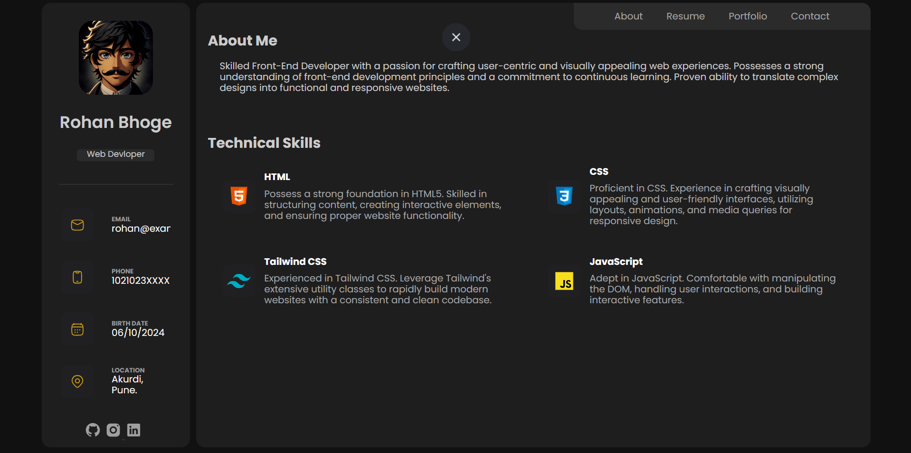
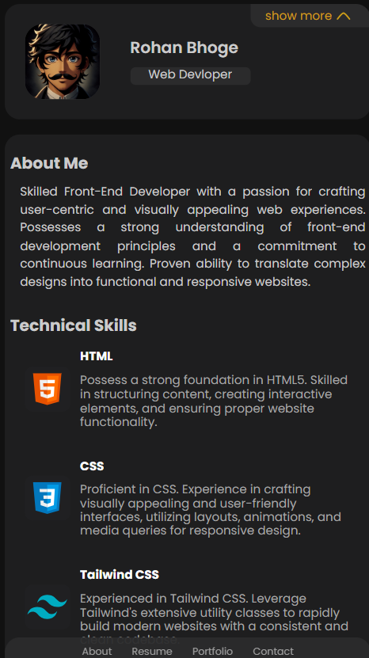
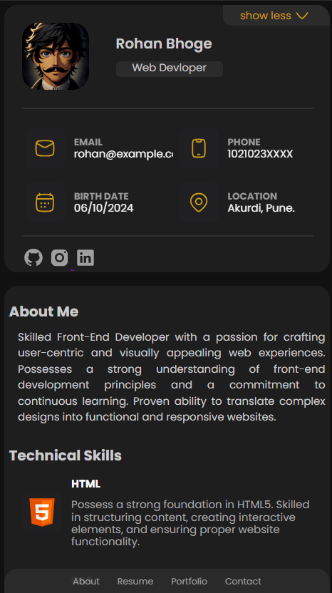
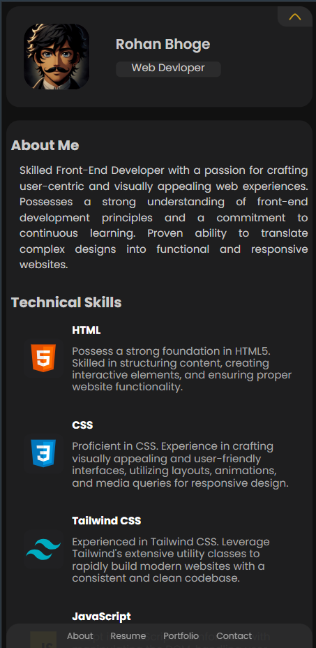
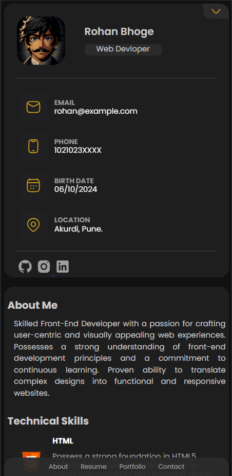

# Portfolio - Personal Website

This is a fully responsive portfolio website designed to effectively showcase my skills and experience. Built using **HTML**, **CSS**, and **JavaScript**, this website provides an intuitive and attractive way to highlight my work and background.

## Table of Contents
- [Preview](#preview)
- [Features](#features)
- [Technologies Used](#technologies-used)
- [Usage](#usage)
- [Deployment](#deployment)
- [Contact](#contact)
- [Acknowledgments](#acknowledgments)

---

## Preview

### 1. Laptop View
  
*Responsive layout on larger screens.*

### 2. Tablet View
  
*Shows an optimized layout for tablet screens.*

### 3. Mobile View (iPhone)
  
*Responsive layout on iPhone screens.*

### 4. Mobile View (Samsung Galaxy)
  
*Responsive layout on Samsung Galaxy devices.*

### 5. Mobile View (Samsung Galaxy)
  
*Responsive design optimized for Samsung Galaxy.*

---

## Features

### Frontend:
- **Responsive Design**: Fully optimized for devices of all screen sizes, ensuring a smooth user experience.
- **Interactive UI**: Dynamic sections that showcase skills, projects, and achievements.
- **Navigation**: Easy-to-use navigation for a seamless experience across sections of the portfolio.
- **Smooth Scrolling**: Modern scroll effects to navigate through different sections.
- **Project Showcase**: Includes a section that highlights various projects I've worked on with detailed descriptions and images.
- 
---

## Technologies Used
- **Frontend**: HTML, CSS, JavaScript.
- **Responsive Design**: Media Queries, Flexbox, Grid Layout.
- **Tools**: Git, GitHub.

---

## Usage
After deploying or running the Portfolio project locally, users can interact with the site in the following ways:

1. **Starting the Application**:
   - Open the `index.html` file in a browser or access the live version of the portfolio.

2. **Homepage & Navigation**:
   - The homepage introduces the sections of the portfolio, including an introduction and navigation to the other areas.

3. **Project Showcase**:
   - Explore various projects and click through to learn more about each one.
   
4. **Contact Information**:
   - The contact section allows users to find my email, GitHub, and LinkedIn profiles.

5. **Responsive Layout**:
   - The portfolio automatically adjusts its layout for devices such as desktops, tablets, and mobiles.

---

## Deployment
The project is deployed and accessible at https://rohanbhoge.github.io/portfolio/.

---

## Contact

Feel free to reach out to me through the following channels:

- **Email**: bhogerohan60@gmail.com
- **GitHub**: [[GitHub](https://github.com/YourGitHub)](https://github.com/RohanBhoge)
- **LinkedIn**: [[LinkedIn](https://www.linkedin.com/in/yourlinkedin)](https://www.linkedin.com/in/rohanbhoge/)

---

## Acknowledgments
- Thanks to the **open-source community** for providing inspiration and resources.
- Gratitude to all the online tutorials and guides that helped me build this project.

---
